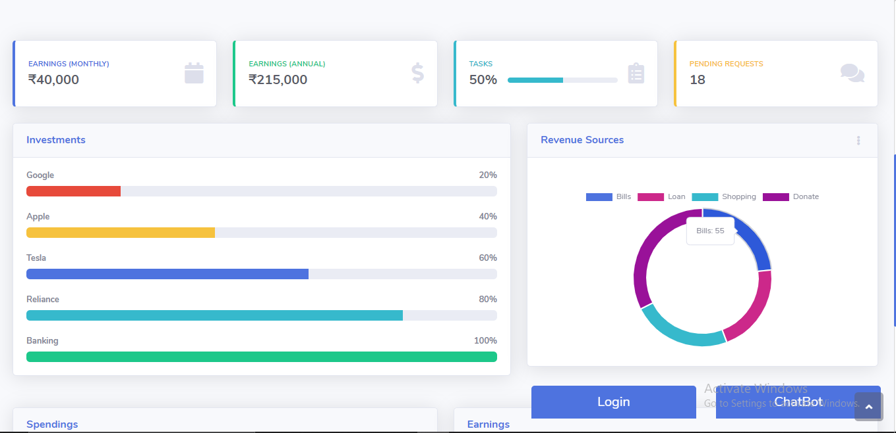
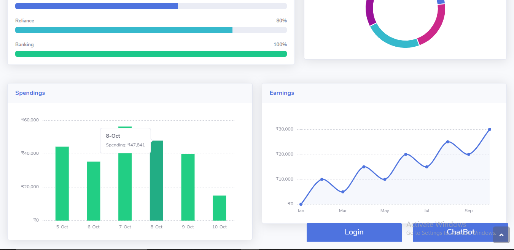
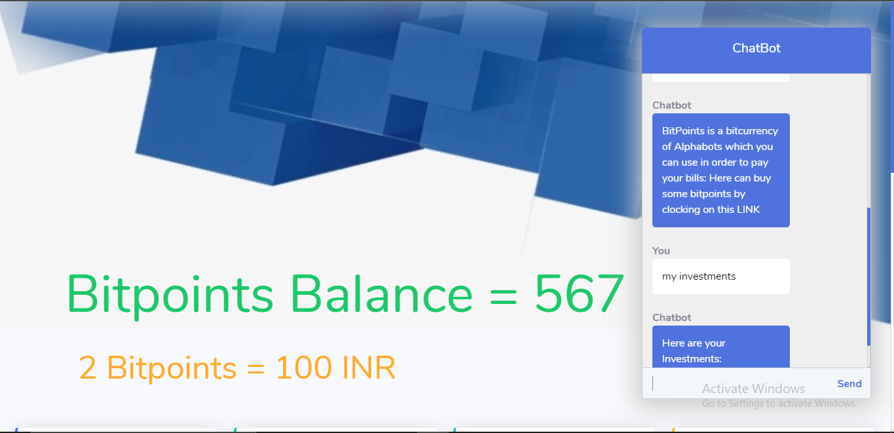
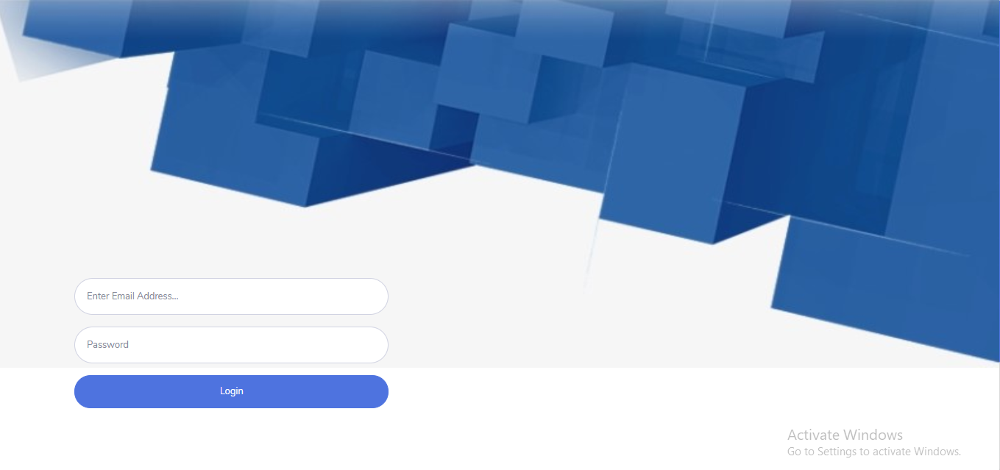

# VIT_Hackathon
This project was done for Vit Hackathon October 2020

Project Team Members:

<li>Nihar Salunke </li>
<li>Nikhil Kulkarni</li>
<li>Shivali Mate</li>

<h1>Output:</h1>
<h2>Dashboard</h2>
    

        
    

<h2>Expenses</h2>
    

        
    

<h2>Home Page and ChatBot</h2>
    

        
    

<h2>Login Page</h2>
    

        
    

<h2>Student Personal Analysis</h2>

  
  

  

  
  

<h2>Digital Report Card</h2>

  
  

<h2>Student Dashboard</h2>

  
  
